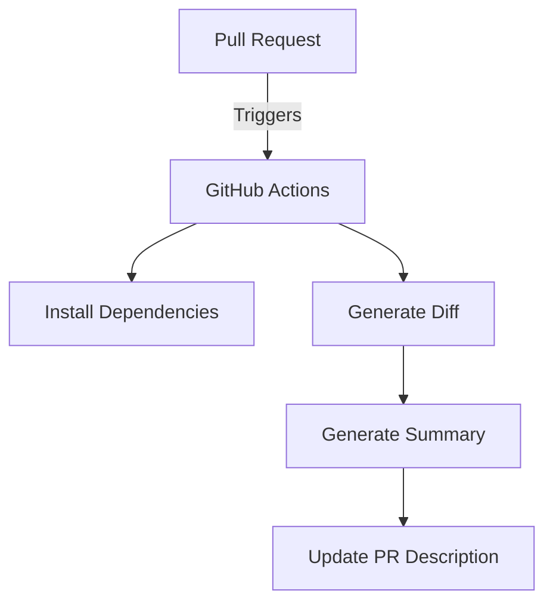

# Source Code Summary Generator

## Goal
The goal of this project is to provide a tool that generates a summary of source code changes in a repository. This is particularly useful for improving the documentation of pull requests by automatically summarizing the changes made.

## Requirements
- **Python 3.x**: The project requires Python for executing scripts.
- **Git**: Necessary for version control and generating diffs.
- **OpenAI API Key**: Required for accessing the OpenAI API to generate summaries.
- **Dependencies**: The project uses several Python packages, including:
  - `openai`
  - `pylint`
  - `pytest`

## High-Level Overview of Changes

### Key Features
- The project automates the process of summarizing changes in pull requests, making it easier for reviewers to understand the modifications.
- It integrates with GitHub Actions for continuous integration and deployment, ensuring that summaries are generated and tested automatically.
- The use of OpenAI's API allows for intelligent summarization based on the context of the changes.

### Usage
To use this project, a user would typically:
1. Clone the repository.
2. Install the required Python packages using the provided Makefile.
3. Set up their OpenAI API key.
4. Use the `make` commands to generate diffs and summaries as needed.

### Overview of the Repository

1. **GitHub Workflows**:
   - **description_summarizer.yml**: This workflow triggers on pull requests and updates the PR description with a summary generated by the OpenAI API.
   - **python.yml**: This workflow runs tests and linting on the Python code when a pull request is made.

2. **Key Files**:
   - **Makefile**: Automates tasks such as installing dependencies, generating diffs, and creating summaries.
   - **README.md**: Provides documentation on the purpose of the project, installation instructions, and usage examples.
   - **Rakefile**: Defines tasks for generating diffs and summaries using Ruby (though the main functionality is in Python).
   - **requirements.txt**: Lists Python dependencies required for the project (e.g., `openai`, `pylint`, `pytest`).
   - **summary.py**: Contains the logic for generating a summary based on the diff file using the OpenAI API.
   - **test_summary.py**: Includes unit tests for the summary generation functionality.

3. **Supporting Files**:
   - **system_prompt.txt**: Contains the system prompt used to guide the OpenAI model in generating summaries.
   - **pull_request_template.md**: A template for pull requests to ensure consistent descriptions.

### Testing
The repository includes unit tests to ensure the functionality of the summary generation, which can be run using `pytest`.

This setup is particularly useful for developers looking to streamline their code review process by providing AI-generated summaries of changes in pull requests. If you have any specific questions or need further details about any part of the repository, feel free to ask!

## References and Links
- [GitHub Actions Documentation](https://docs.github.com/ru/actions)
- [OpenAI API Documentation](https://platform.openai.com/docs/api-reference)
